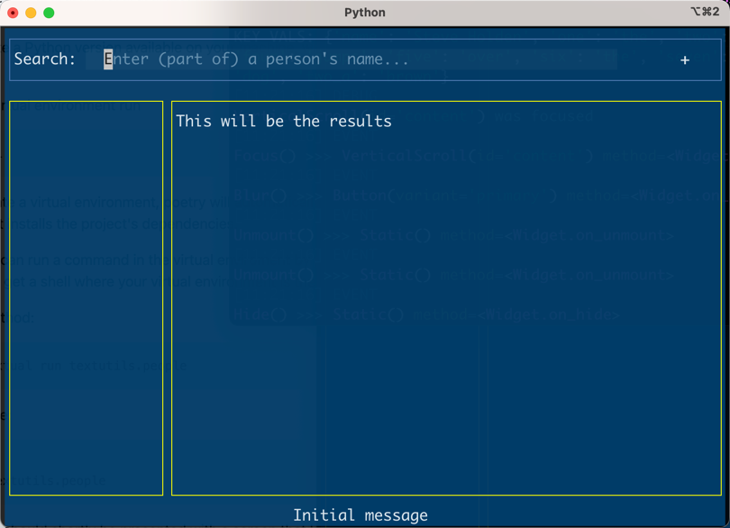

## SKVE - A simple key-value editor

Hi, and welcome to the Alpha 0.0.1 release of skve (pronounced "skyve").

This is my first Textual application,
so the main point of publishing it
is to get feedback and ideas for improvement
in any and all aspects of the code,
which is at present vestigial.

The project uses the [`poetry`](https://python-poetry.org/docs/) utility.
Installation is normally straightforward.
Once you have installed it,
the following instructions should suffice.

### Create the virtual environment [optional]

Poetry creates virtual environments for a project -
the _pyproject.toml_ details the dependencies and
various other aspect of the project.

If you'd like to use a specific version of Python,
run the following command with no virtual environment active.
This step is optional.

```shell
poetry env use 3.X
```

3.X should indicate a Python version
available on your machine,
which can be anywhere from 8 to 11
at the time of writing.

### Install the dependencies

To populate the virtual environment run

```shell
poetry install
```

If you did not create a virtual environment,
poetry will automatically create one
using your environment's default python,
in which it installs the project's dependencies.

### Running the editor

From now on you can run a command
in the virtual enviroment
by prefixing it with `poetry run`.
Alternatively, run `poetry shell`
to get a shell where your virtual
environment is the default `python`.

Using the first method:

    poetry run textual run textutils.people

In the second case:

    poetry shell
    textual run textutils.people

In either case
you should shortly be presented with
a screen that looks similar to this.



Enter one or more letters in the search window and names will appear,
the list being updated at each keystroke.

Clicking on a name beings up that person's data in the results window,
and clicking on any row allows you to edit that value (but not the key,
currently). Saving a record changes its value for the rest of the
run, but any new run will always begin with the same initial data.

I don't yet understand the textual testing framework,
which is why there aren't currently any tests to speak of.
A recent release included more realistic test data from
a random generator.

I'll be happy to consider all feedback.
